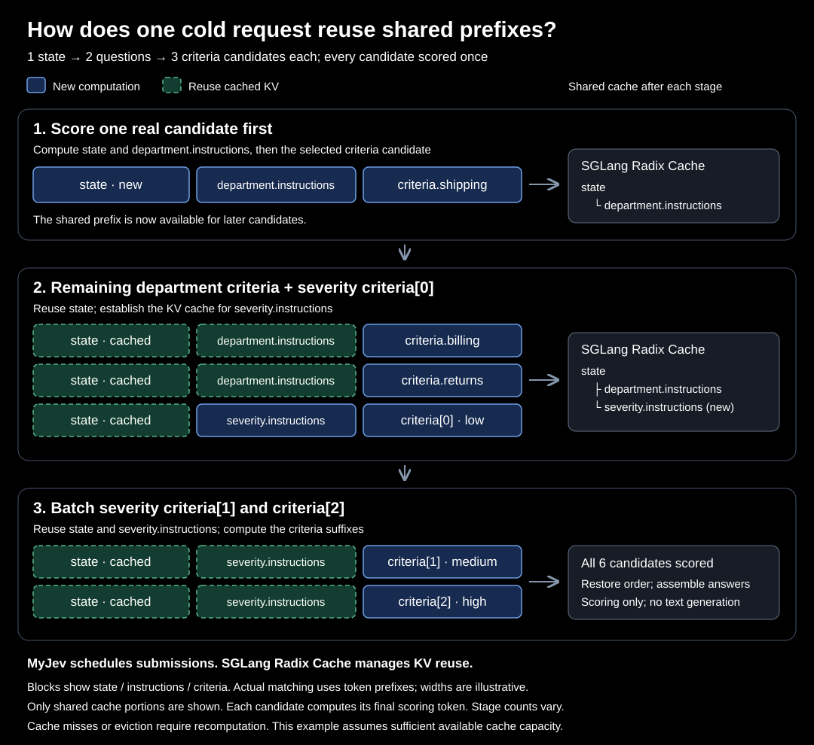

# 共享前缀提交

[English](shared-prefix-cache.md) · [返回 README](../README_zh.md)

请先阅读 [MyJev 的候选评分方式](request-to-model_zh.md)，了解请求模型以及二元
分数如何组成最终答案。

共享前缀提交是 SGLang 后端针对一次 MyJev 请求产生多个候选判断时的优化。它
复用完全相同输入前缀的 KV 结果，避免重复计算。对长上下文、多候选请求来说，
即使没有任何历史请求命中缓存，也可能获得收益。

本地 Python `SGLangBackend` 和 `myjev-serve` 提供的 `/v1/systemone` 接口默认使用
分阶段提交；`TransformersBackend` 目前不支持这种提交策略。

## 为什么输入会重复计算？

假设 `state` 是一段客户描述，请求同时需要判断负责部门和严重程度。MyJev 会把
Choice 的每个选项、Score 的每个等级分别变成一个 yes/no 判断。分词后的输入在
概念上具有这样的共享结构：

```text
state：客户描述
├── department instructions
│   ├── shipping
│   ├── billing
│   └── returns
└── severity instructions
    ├── low
    ├── medium
    └── high
```

所有候选共享 `state`；同一道题的候选还共享该题的 `instructions`。真正的复用
边界发生在提示渲染、聊天模板和完整分词之后；意思相近但位置不同的文本，不
保证能复用。

模型处理 token 时会保存注意力计算所需的中间结果，也就是 KV cache。如果后续
输入具有完全相同的 token 前缀，引擎就可以复用这些结果，并从输入开始分叉的位置
继续计算。

## 分阶段提交

一次性提交所有候选，并不能保证公共前缀在这些候选开始计算前已经可用。分阶段
提交会先发送一个真实候选来建立前缀，再发送可以复用它的候选。互不依赖的分支
可以在同一阶段处理；更深的分支可能需要下一阶段。



以上例来说，一种提交顺序是：

1. 先评分一个部门候选，建立共享 `state` 和 department instructions 的前缀。
2. 评分其余部门候选和一个严重程度候选；后者会建立该题的前缀。
3. 评分其余严重程度候选。

每个候选只评分一次，没有额外的预热问题。输入内容保持不变，结果仍按原来的
问题和候选顺序返回。实际分组由 token 前缀决定，不固定为三轮。

这里的**冷请求**指相关前缀还没有缓存，但模型已加载、计算内核已预热。分阶段
会在同一个冷请求内部建立并复用缓存；它不会加速模型加载或首次内核编译。

## 输出与限制

提交模式不会改变响应结构。MyJev 仍然只读取下一个 token 的 yes/no 分数，不生成
回答文本。`usage.input_tokens` 统计所有完整候选输入的逻辑 token 总数；
`usage.output_tokens` 为 0。缓存命中减少实际计算量，不会降低这个逻辑计数。

BF16 下，执行顺序和 batch 形状可能带来概率差异。接近并列的候选在不同模式中
可能改变排名。评估行为时应比较组装和归一化后的最终答案。

分阶段提交要求启用 SGLang 的 Radix Cache。与
`engine_kwargs={"disable_radix_cache": True}` 或 `--disable-radix-cache`
同时使用会报错。SGLang 负责缓存分配、复用和驱逐；前缀可能跨请求保留，也可能
在空间不足时被驱逐。由于引擎可能预先分配 KV 池，缓存复用不一定让显示的 GPU
显存占用同步下降。

目前请对同一个 Python 后端实例串行调用；HTTP 服务的分阶段提交并发性能尚未
验证。
